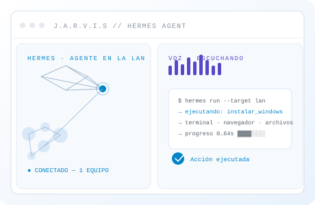
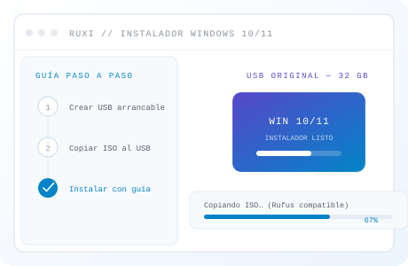
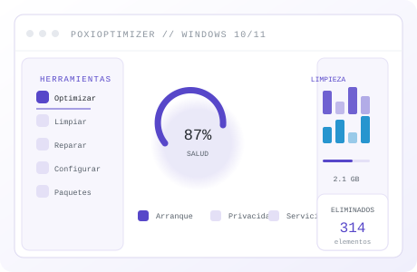
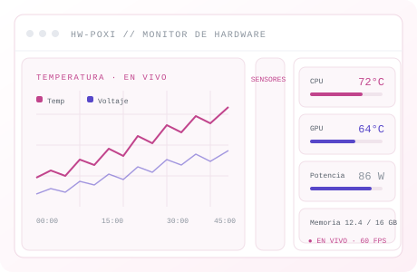
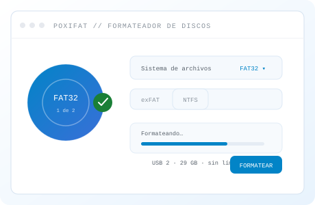
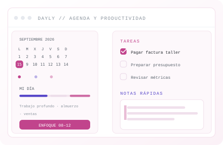

<picture>
  <source media="(prefers-color-scheme: dark)" srcset=".github/assets/hero-dark.svg">
  
</picture>

<!-- gallery:start -->
<table width="100%">
<tr>
<td width="33.33%" valign="top"> <b><a href="https://github.com/PoxiiTV/JARVIS">JARVIS</a></b> Interfaz 3D de escritorio con voz y visión. Hermes Agent ejecuta archivos, terminal y navegador en otro equipo de la LAN. <code>Python</code> <code>Electron</code> <code>Hermes</code></td>
<td width="33.33%" valign="top"> <b><a href="https://github.com/PoxiiTV/Ruxi-Custom-Rufus">Ruxi Custom Rufus</a></b> Instala Windows 10/11 desde un USB con guía paso a paso. <code>1★</code> <code>C</code> <code>GPL-3.0</code> · <a href="https://poxiitv.github.io/Ruxi-Custom-Rufus/">live</a></td>
<td width="33.33%" valign="top"> <b><a href="https://github.com/PoxiiTV/PoxiOptimizer">PoxiOptimizer</a></b> Optimizar, limpiar y reparar Windows 10/11 desde un solo sitio. <code>2★</code> <code>TypeScript</code></td>
</tr>
<tr>
<td width="33.33%" valign="top"> <b><a href="https://github.com/PoxiiTV/HW-Poxi">HW-Poxi</a></b> Temperatura, frecuencia, voltaje y potencia del sistema en tiempo real. <code>2★</code> <code>TypeScript</code></td>
<td width="33.33%" valign="top"> <b><a href="https://github.com/PoxiiTV/poxifat">poxifat</a></b> Formatea USB y discos a FAT32 sin el límite de 32 GB — o a exFAT/NTFS. <code>Rust</code></td>
<td width="33.33%" valign="top"> <b><a href="https://github.com/PoxiiTV/Dayly">Dayly</a></b> Calendario, mi día con time-blocking, tareas, notas, proyectos, hábitos y objetivos en una PWA instalable. <code>TypeScript</code> <code>React</code> <code>Node.js</code> <code>Prisma</code> · <a href="https://poxiitv.github.io/Dayly/">live</a></td>
</tr>
</table>
<!-- gallery:end -->

<!-- crystal:start -->

  

<!-- crystal:end -->

España · <a href="https://github.com/PoxiiTV">PoxiiTV</a>