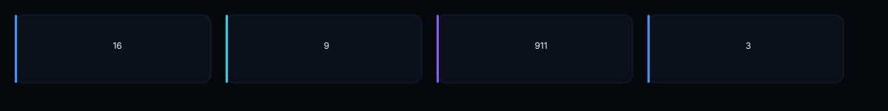
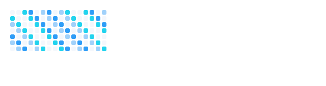
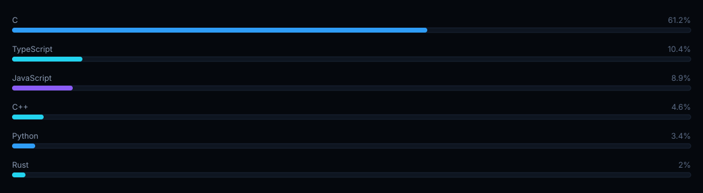

<picture>
  <source media="(prefers-color-scheme: dark)" srcset=".github/assets/hero-dark.svg">
  
</picture>

 

<table width="100%">
<tr>

<!-- ================== COLUMNA PERFIL ================== -->
<td width="30%" valign="top" align="center">

 

 

<big><b>Alexis</b></big> 
<code>PoxiTV</code>

 

Desarrollador de aplicaciones de escritorio · Windows · TypeScript · Rust · Electron · Software en español para gente normal.

 

 

📍 Alicante, España 
✉️ alexissjuarezz10@gmail.com 
◉ <a href="https://github.com/PoxiiTV">PoxiiTV</a>

</td>

<!-- ================== PRESENTACIÓN / STACK ================== -->
<td valign="top">

 

## ¡Hola! Soy Alexis 👋

**Desarrollador Full Stack & creador de herramientas para Windows.**

Creo aplicaciones que resuelven problemas reales, con especial atención al rendimiento, la experiencia de usuario y una interfaz limpia.

● Disponible para proyectos freelance y colaboraciones

 

### 🔧 Stack principal

<table width="100%">
<tr align="center">
<td> <b>TypeScript</b></td>
<td> <b>Rust</b></td>
<td> <b>Electron</b></td>
<td> <b>React</b></td>
<td> <b>Node.js</b></td>
<td></td>
</tr>
<tr align="center">
<td> <b>Tailwind</b></td>
<td> <b>Prisma</b></td>
<td> <b>Python</b></td>
<td> <b>C</b></td>
<td> <b>C++</b></td>
<td> <b>Git</b></td>
</tr>
</table>

</td>
</tr>
</table>

---

## 🚀 En qué trabajo

<!-- PROYECTOS -->
<table width="100%">
<tr>
<td width="25%" align="center" valign="top"> <b>JARVIS</b> Interfaz 3D de escritorio con voz y visión. Hermes Agent ejecuta archivos, terminal y navegador en otro equipo de la LAN. <code>Python</code> <code>Electron</code> <code>Hermes</code></td>
<td width="25%" align="center" valign="top"> <b>Ruxi Custom Rufus</b> Instala Windows 10/11 desde un USB con una guía paso a paso, gratis y sin tecnicismos. <code>1★</code> <code>C</code> <code>GPL-3.0</code> · <a href="https://poxiitv.github.io/Ruxi-Custom-Rufus/">live</a></td>
<td width="25%" align="center" valign="top"> <b>PoxiOptimizer</b> Optimizar, limpiar y reparar Windows 10/11 desde un solo sitio. <code>2★</code> <code>TypeScript</code> <code>Windows</code></td>
<td width="25%" align="center" valign="top"> <b>HW-Poxi</b> Monitor de hardware para Windows: temperatura, frecuencia, voltaje y potencia en tiempo real. <code>2★</code> <code>TypeScript</code> <code>Electron</code></td>
</tr>
<tr>
<td width="25%" align="center" valign="top"> <b>poxifat</b> Formatea USB y discos a FAT32 sin el límite de 32 GB, o a exFAT/NTFS. <code>Rust</code> <code>Windows</code></td>
<td width="25%" align="center" valign="top"> <b>Dayly</b> Calendario, time-blocking, tareas, notas, proyectos, hábitos y objetivos en una PWA instalable. <code>TypeScript</code> <code>React</code> <code>Prisma</code> · <a href="https://poxiitv.github.io/Dayly/">live</a></td>
<td width="25%" align="center" valign="top"> <b>CDTaller</b> <em>(privado)</em> <a href="https://controldeltaller.es"><b>controldeltaller.es</b></a> Gestión de talleres: clientes, vehículos, piezas, presupuestos y facturación VERI\*FACTU (SHA-256 encadenado). <code>React</code> <code>TypeScript</code> <code>Electron</code> <code>Zustand</code></td>
<td width="25%" align="center" valign="top"><a href="https://github.com/PoxiiTV?tab=repositories">  <b>Y muchos más…</b> Siempre trabajando en nuevas ideas y herramientas que solucionen problemas reales.</a></td>
</tr>
</table>

---

## 📊 Estadísticas de GitHub

 

<table width="100%">
<tr>
<td valign="top">
<b>Contribuciones (último año)</b>  

</td>
<td width="45%" valign="top">
<b>Lenguajes más usados</b>  

</td>
</tr>
</table>

 

---

## 🛠️ Herramientas & Entorno

<table width="100%">
<tr align="center">
<td> VS Code</td>
<td> Git</td>
<td> GitHub</td>
<td> Windows 11</td>
<td> Docker</td>
<td> Figma</td>
<td> Postman</td>
</tr>
</table>

 

<table width="100%">
<tr>

<td width="50%" valign="top">
<b>🌐 Actualmente</b>  
✓ Mejorando PoxiTV y sus herramientas 
✓ Explorando nuevas tecnologías 
✓ Creando nuevos proyectos 
✓ Disponible para proyectos freelance
</td>

<td width="50%" valign="top">
<b>💬 Contacto</b>  
✉️ correo: <a href="mailto:alexissjuarezz10@gmail.com">alexissjuarezz10@gmail.com</a> 
◉ GitHub: <a href="https://github.com/PoxiiTV">@PoxiiTV</a> 
📍 Ubicación: Alicante, España
</td>

</tr>
</table>

 

> **"La mejor manera de predecir el futuro es creándolo."** 
> — Alan Kay

 

Hecho con cariño por <a href="https://github.com/PoxiiTV">PoxiTV</a> · 2026