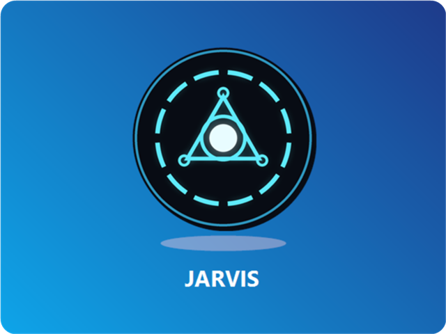
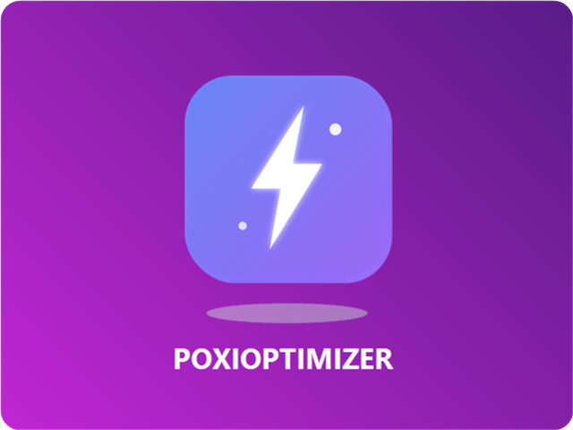
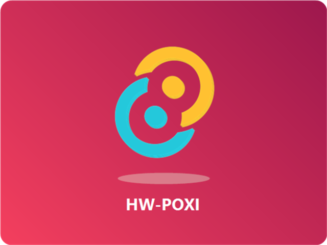
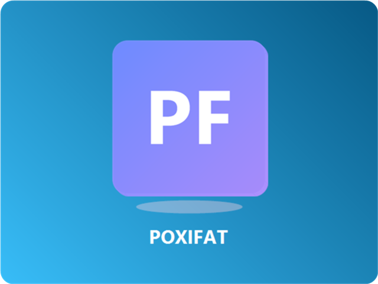
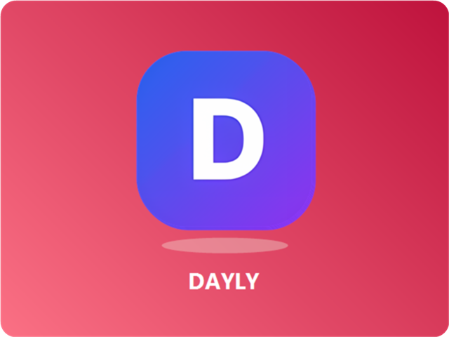
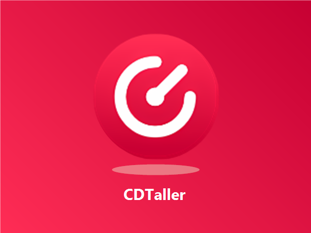

<picture>
  <source media="(prefers-color-scheme: dark)" srcset=".github/assets/hero-dark.svg">
  
</picture>

### ¡Hola! Soy Alexis 👋

Hago **aplicaciones de escritorio para Windows**: herramientas que resuelven problemas concretos, con interfaz cuidada y pensadas para que las use cualquiera, no solo alguien técnico. Casi todo en español.

---

### 🛠️ En qué trabajo

<table width="100%">
<tr>
<td width="33.33%" valign="top"> <b><a href="https://github.com/PoxiiTV/JARVIS">JARVIS</a></b> Interfaz 3D de escritorio con voz y visión. Hermes Agent ejecuta archivos, terminal y navegador en otro equipo de la LAN. <code>Python</code> <code>Electron</code> <code>Hermes</code></td>
<td width="33.33%" valign="top"> <b><a href="https://github.com/PoxiiTV/Ruxi-Custom-Rufus">Ruxi Custom Rufus</a></b> Instala Windows 10/11 desde un USB con guía paso a paso. <code>1★</code> <code>C</code> <code>GPL-3.0</code> · <a href="https://poxiitv.github.io/Ruxi-Custom-Rufus/">live</a></td>
<td width="33.33%" valign="top"> <b><a href="https://github.com/PoxiiTV/PoxiOptimizer">PoxiOptimizer</a></b> Optimizar, limpiar y reparar Windows 10/11 desde un solo sitio. <code>2★</code> <code>TypeScript</code></td>
</tr>
<tr>
<td width="33.33%" valign="top"> <b><a href="https://github.com/PoxiiTV/HW-Poxi">HW-Poxi</a></b> Temperatura, frecuencia, voltaje y potencia del sistema en tiempo real. <code>2★</code> <code>TypeScript</code></td>
<td width="33.33%" valign="top"> <b><a href="https://github.com/PoxiiTV/poxifat">poxifat</a></b> Formatea USB y discos a FAT32 sin el límite de 32 GB — o a exFAT/NTFS. <code>Rust</code></td>
<td width="33.33%" valign="top"> <b><a href="https://github.com/PoxiiTV/Dayly">Dayly</a></b> Calendario, mi día con time-blocking, tareas, notas, proyectos, hábitos y objetivos en una PWA instalable. <code>TypeScript</code> <code>React</code> <code>Node.js</code> <code>Prisma</code> · <a href="https://poxiitv.github.io/Dayly/">live</a></td>
</tr>
<tr>
<td width="33.33%" valign="top"> <b>CDTaller</b> <em>(privado)</em> <a href="https://controldeltaller.es">controldeltaller.es</a> Programa de gestión para un taller mecánico: coches, clientes, piezas, presupuestos y facturación. Incluye VERI\*FACTU (RD 1007/2023): huella SHA-256 encadenada, numeración sin huecos y documentos inalterables. <code>React</code> <code>TypeScript</code> <code>Electron</code> <code>Zustand</code></td>
<td width="33.33%"></td>
<td width="33.33%"></td>
</tr>
</table>

---

### 🧰 Con qué trabajo

| Área | Stack |
|---|---|
| **Lenguajes** | TypeScript · JavaScript · Rust · C · Python · HTML · CSS |
| **Interfaz** | React · React Router · Zustand · CSS moderno, sin frameworks |
| **Escritorio** | Electron · Node.js · electron-builder — instaladores y versiones portables para Windows |
| **Herramientas** | Vite · Vitest · Git · GitHub · npm |
| **Y además** | Cifrado AES-256 y firmas SHA-256 · consumo de APIs REST · almacenamiento local y copias de seguridad · pruebas automatizadas · normativa española de facturación electrónica (VERI\*FACTU) y protección de datos (RGPD) |

### 📬 Contacto

Abierto a proyectos y oportunidades. 📧 [alexissjuarezz10@gmail.com](mailto:alexissjuarezz10@gmail.com)

---

España · <a href="https://github.com/PoxiiTV">PoxiiTV</a>