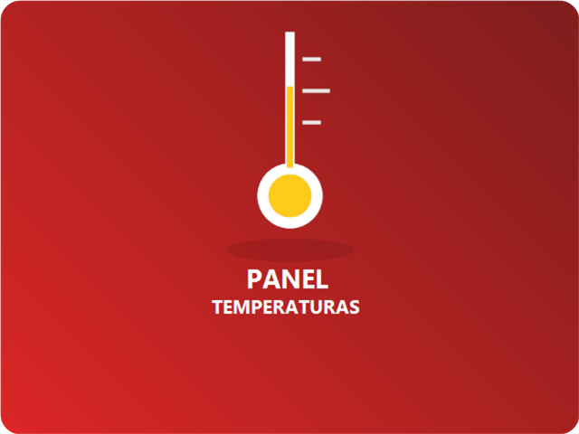

<table width="100%">
<tr>

<td width="62%" valign="top">

 

<code>DEV · DESKTOP · WINDOWS</code>

## Desarrollador Full Stack & creador de herramientas para Windows

Creo aplicaciones que resuelven problemas reales, con especial atención al **rendimiento**, la **experiencia de usuario** y una **interfaz limpia**.

- 🧠 Código limpio y mantenible
- ⚡ Optimizado para volar en cualquier equipo
- 🎨 Interfaces cuidadas y fáciles de usar

 

<kbd>&nbsp;Clean Code&nbsp;</kbd> <kbd>&nbsp;Rendimiento&nbsp;</kbd> <kbd>&nbsp;UX/UI&nbsp;</kbd> <kbd>&nbsp;Innovación&nbsp;</kbd>

 

● **Disponible para proyectos freelance y colaboraciones**

</td>

<td width="38%" valign="top">

 

<table width="100%">
<tr>
<td align="center">

<code>DATOS RÁPIDOS</code>

  

<table>
<tr><td>💻</td><td><b>Plataforma</b> Windows 10 / 11</td></tr>
<tr><td>🪟</td><td><b>Enfoque</b> Apps de escritorio</td></tr>
<tr><td>🧩</td><td><b>Perfil</b> Full Stack</td></tr>
<tr><td>📍</td><td><b>Ubicación</b> Alicante, España</td></tr>
<tr><td>✨</td><td><b>Idioma</b> Software en español</td></tr>
</table>

</td>
</tr>
</table>

</td>

</tr>
</table>

---

## 🧰 Stack principal

<table>
<tbody>
<tr align="center">
<td> <b>TypeScript</b></td>
<td> <b>Rust</b></td>
<td> <b>Electron</b></td>
<td> <b>React</b></td>
<td> <b>Node.js</b></td>
</tr>
<tr align="center">
<td> <b>Python</b></td>
<td> <b>C</b></td>
<td> <b>C++</b></td>
<td> <b>Tailwind</b></td>
<td> <b>Prisma</b></td>
</tr>
</tbody>
</table>

---

## 🚀 En qué trabajo

<table width="100%">
<tr>
<td width="33.33%" valign="top"> <b><a href="https://github.com/PoxiiTV/JARVIS">JARVIS</a></b> Interfaz 3D de escritorio con voz y visión. Hermes Agent ejecuta archivos, terminal y navegador en otro equipo de la LAN. <code>Python</code> <code>Electron</code> <code>Hermes</code></td>
<td width="33.33%" valign="top"> <b><a href="https://github.com/PoxiiTV/Ruxi-Custom-Rufus">Ruxi Custom Rufus</a></b> Instala Windows 10/11 desde un USB con guía paso a paso. <code>1★</code> <code>C</code> <code>GPL-3.0</code> <a href="https://poxiitv.github.io/Ruxi-Custom-Rufus/"><kbd>&nbsp;🌐 Web del proyecto →&nbsp;</kbd></a></td>
<td width="33.33%" valign="top"> <b><a href="https://github.com/PoxiiTV/PoxiOptimizer">PoxiOptimizer</a></b> Optimizar, limpiar y reparar Windows 10/11 desde un solo sitio. <code>2★</code> <code>TypeScript</code></td>
</tr>
<tr>
<td width="33.33%" valign="top"> <b><a href="https://github.com/PoxiiTV/HW-Poxi">HW-Poxi</a></b> Temperatura, frecuencia, voltaje y potencia del sistema en tiempo real. <code>2★</code> <code>TypeScript</code></td>
<td width="33.33%" valign="top"> <b><a href="https://github.com/PoxiiTV/poxifat">poxifat</a></b> Formatea USB y discos a FAT32 sin el límite de 32 GB, o a exFAT/NTFS. <code>Rust</code></td>
<td width="33.33%" valign="top"> <b><a href="https://github.com/PoxiiTV/Dayly">Dayly</a></b> Calendario, mi día con time-blocking, tareas, notas, proyectos, hábitos y objetivos en una PWA instalable. <code>TypeScript</code> <code>React</code> <code>Node.js</code> <code>Prisma</code> <a href="https://poxiitv.github.io/Dayly/"><kbd>&nbsp;🚀 Abrir demo →&nbsp;</kbd></a></td>
</tr>
<tr>
<td width="33.33%" valign="top"> <b>CDTaller</b> <em>(privado)</em> <a href="https://controldeltaller.es">controldeltaller.es</a> Programa de gestión para talleres mecánicos con facturación VERI\*FACTU: huella SHA-256 encadenada, numeración sin huecos y documentos inalterables. AES-256 y RGPD. <code>React</code> <code>TypeScript</code> <code>Electron</code> <code>Zustand</code> <a href="https://controldeltaller.es"><kbd>&nbsp;🌐 Abrir web →&nbsp;</kbd></a></td>
<td width="33.33%" valign="top"> <b><a href="https://github.com/PoxiiTV/Panel-TEMPERATURAS">Panel-TEMPERATURAS</a></b> Panel para mostrar temperaturas en tiempo real. <code>HTML</code> <a href="https://poxiitv.github.io/Panel-TEMPERATURAS/"><kbd>&nbsp;🚀 Abrir demo →&nbsp;</kbd></a></td>
<td width="33.33%" valign="top">  <a href="https://github.com/PoxiiTV?tab=repositories"><b>Y muchos más…</b></a> Siempre trabajando en nuevas ideas y herramientas que solucionen problemas reales. <a href="https://github.com/PoxiiTV?tab=repositories">Ver todos los repositorios →</a></td>
</tr>
</table>

---

## 🛠️ Herramientas & Entorno

<table>
<tbody>
<tr align="center">
<td> <b>Git</b></td>
<td> <b>GitHub</b></td>
<td> <b>Docker</b></td>
<td> <b>Vite</b></td>
</tr>
</tbody>
</table>

---

## 🌐 Actualmente

- ✅ Mejorando PoxiTV y sus herramientas
- ✅ Explorando nuevas tecnologías
- ✅ Disponible para proyectos freelance

---

## 💬 Contacto

**Correo:** alexissjuarezz10@gmail.com · **GitHub:** [@PoxiiTV](https://github.com/PoxiiTV) · **Ubicación:** Alicante, España

---

> "La mejor manera de predecir el futuro es creándolo."
> — Alan Kay

Hecho con cariño por Alexis
