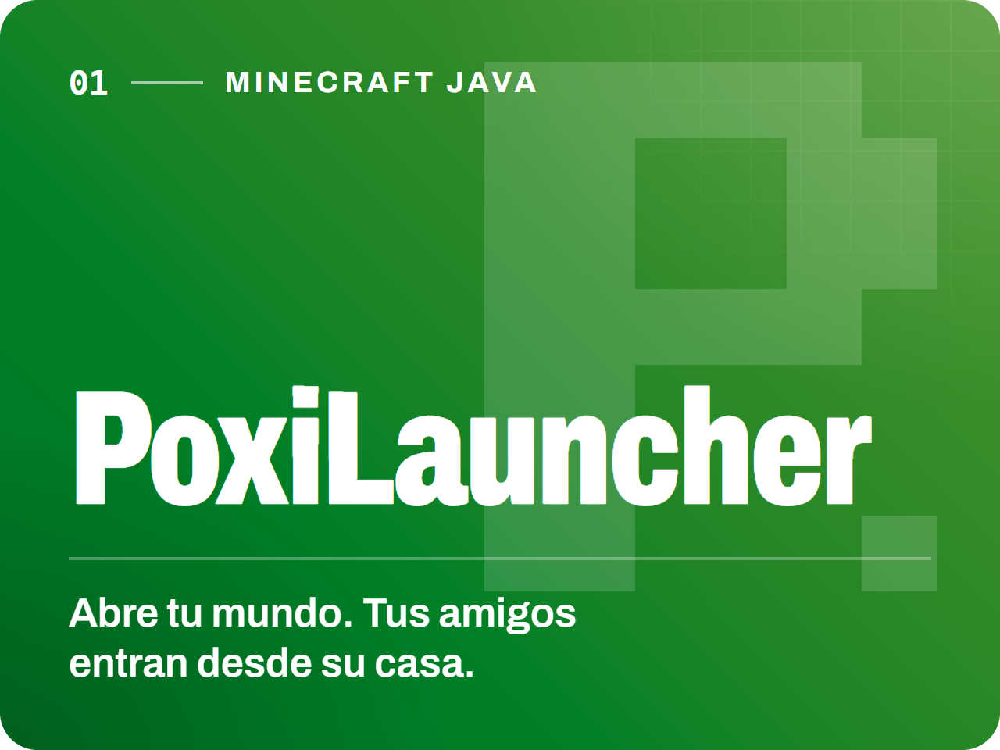
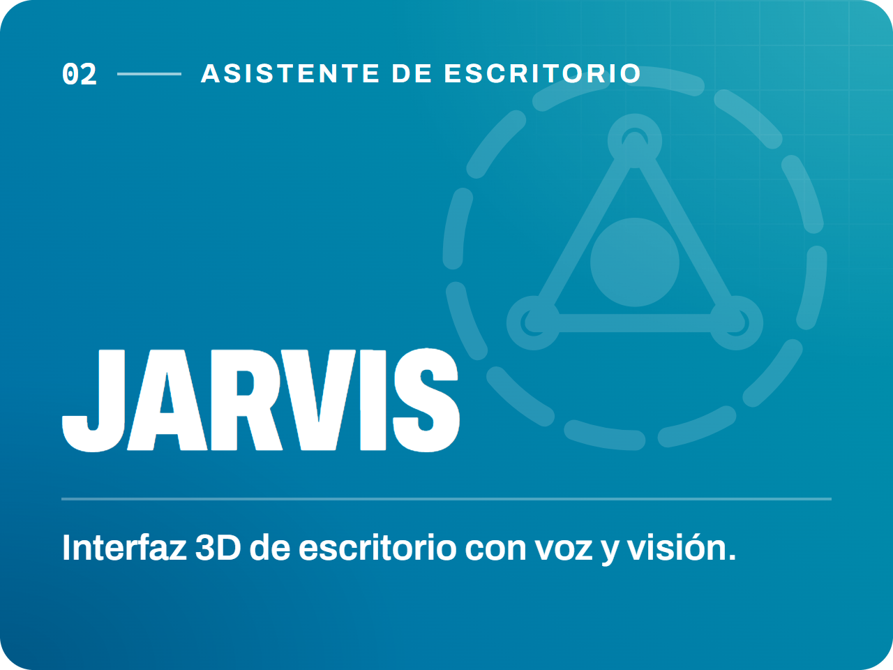
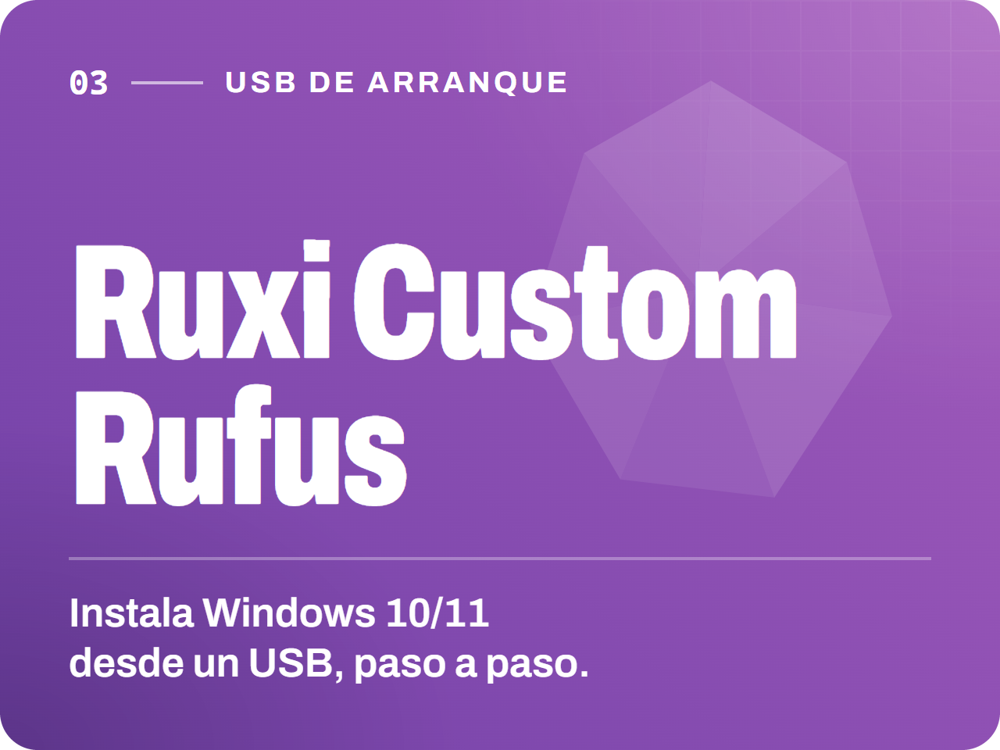
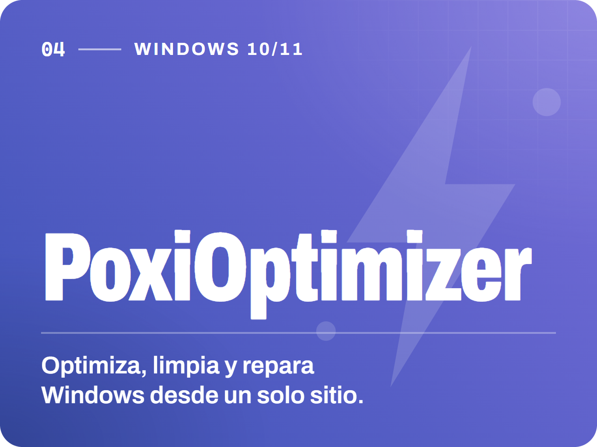
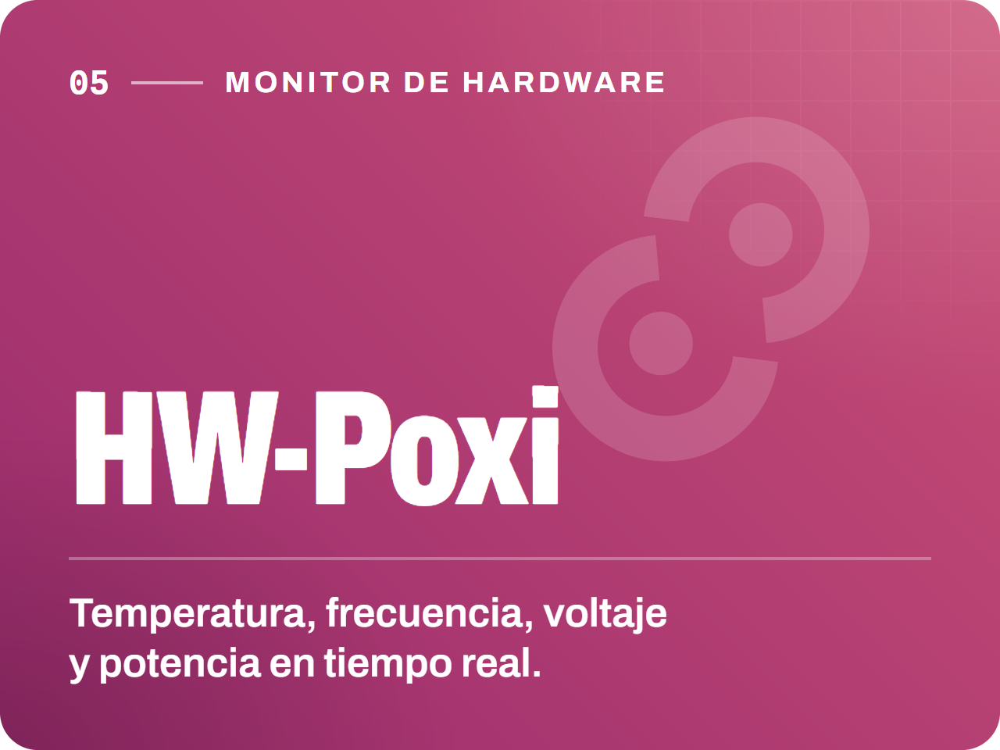
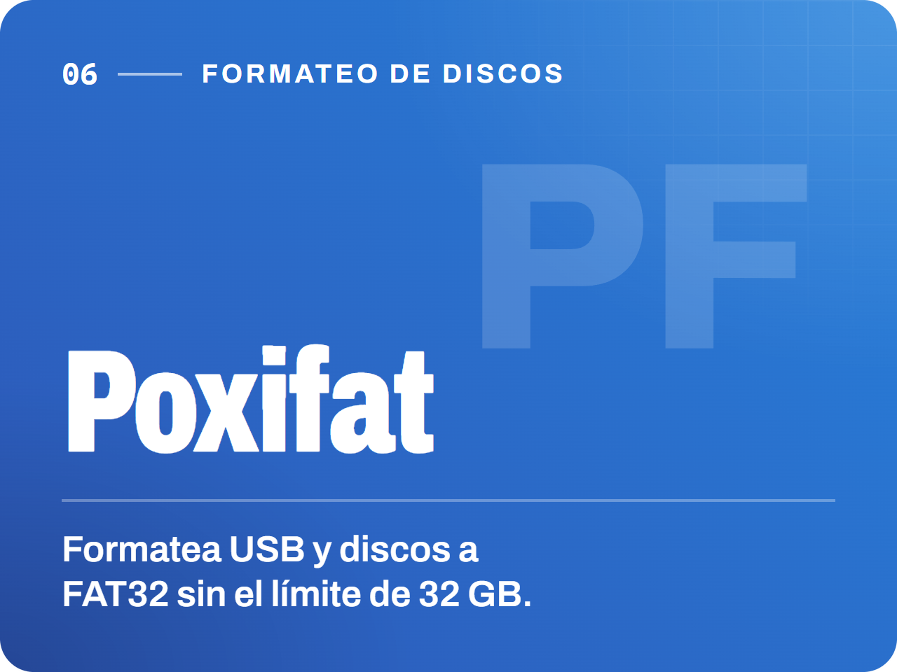
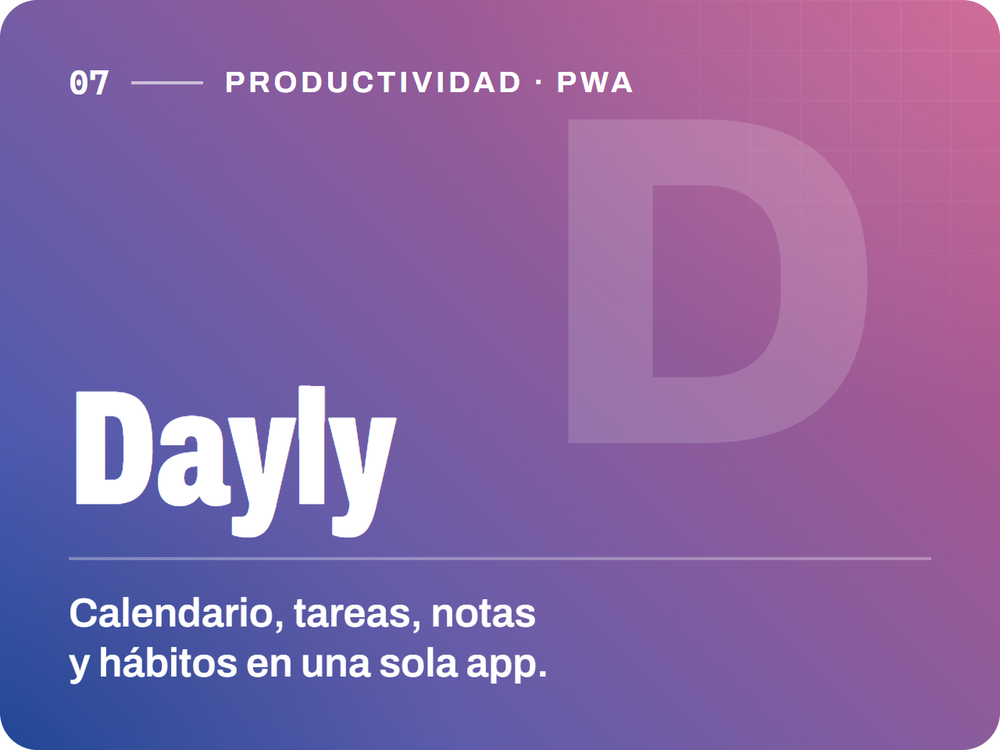
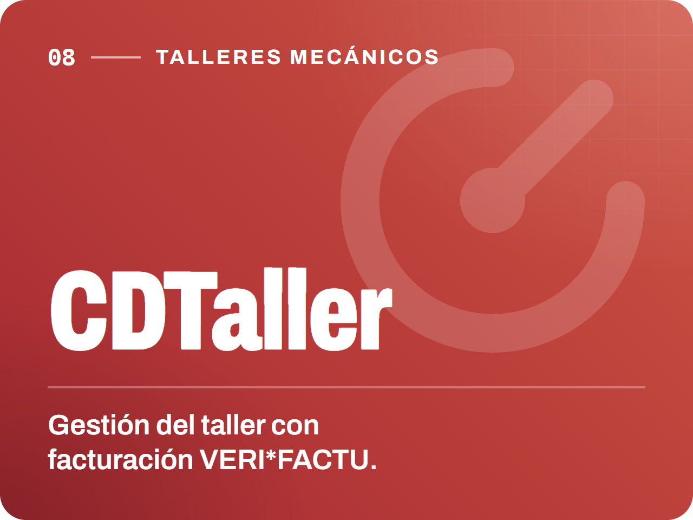
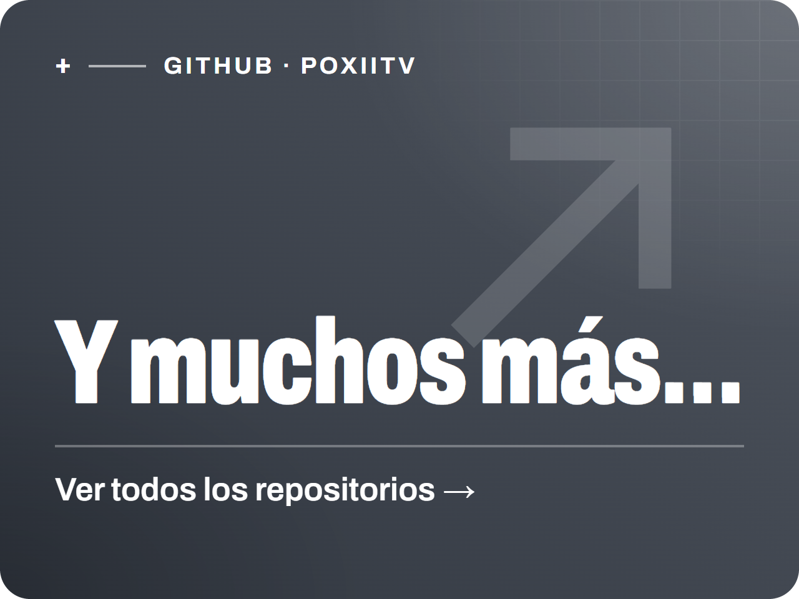

<table width="100%">
<tr>

<td width="62%" valign="top">

 

<code>DEV · DESKTOP · WINDOWS</code>

## Desarrollador Full Stack & creador de herramientas para Windows

Creo aplicaciones que resuelven problemas reales, con especial atención al **rendimiento**, la **experiencia de usuario** y una **interfaz limpia**.

- 🧠 Código limpio y mantenible
- ⚡ Optimizado para volar en cualquier equipo
- 🎨 Interfaces cuidadas y fáciles de usar

 

<kbd>&nbsp;Clean Code&nbsp;</kbd> <kbd>&nbsp;Rendimiento&nbsp;</kbd> <kbd>&nbsp;UX/UI&nbsp;</kbd> <kbd>&nbsp;Innovación&nbsp;</kbd>

 

● **Disponible para proyectos freelance y colaboraciones**

</td>

<td width="38%" valign="top">

 

<table width="100%">
<tr>
<td align="center">

<code>DATOS RÁPIDOS</code>

  

<table>
<tr><td>💻</td><td><b>Plataforma</b> Windows 10 / 11</td></tr>
<tr><td>🪟</td><td><b>Enfoque</b> Apps de escritorio</td></tr>
<tr><td>🧩</td><td><b>Perfil</b> Full Stack</td></tr>
<tr><td>📍</td><td><b>Ubicación</b> Alicante, España</td></tr>
<tr><td>✨</td><td><b>Idioma</b> Software en español</td></tr>
</table>

</td>
</tr>
</table>

</td>

</tr>
</table>

---

## 🧰 Stack principal

<table>
<tbody>
<tr align="center">
<td> <b>TypeScript</b></td>
<td> <b>Rust</b></td>
<td> <b>Electron</b></td>
<td> <b>React</b></td>
<td> <b>Node.js</b></td>
</tr>
<tr align="center">
<td> <b>Python</b></td>
<td> <b>C</b></td>
<td> <b>C++</b></td>
<td> <b>Tailwind</b></td>
<td> <b>Prisma</b></td>
</tr>
</tbody>
</table>

---

## 🚀 En qué trabajo

<table width="100%">
<tr>
<td width="33.33%"></td>
<td width="33.33%"></td>
<td width="33.33%"></td>
</tr>
<tr>
<td width="33.33%"></td>
<td width="33.33%"></td>
<td width="33.33%"></td>
</tr>
<tr>
<td width="33.33%"></td>
<td width="33.33%"></td>
<td width="33.33%"></td>
</tr>
</table>

---

## 🛠️ Herramientas & Entorno

<table>
<tbody>
<tr align="center">
<td> <b>Git</b></td>
<td> <b>GitHub</b></td>
<td> <b>Docker</b></td>
<td> <b>Vite</b></td>
</tr>
</tbody>
</table>

---

## 🌐 Actualmente

- ✅ Mejorando PoxiTV y sus herramientas
- ✅ Explorando nuevas tecnologías
- ✅ Disponible para proyectos freelance

---

## 💬 Contacto

**Correo:** alexissjuarezz10@gmail.com · **GitHub:** [@PoxiiTV](https://github.com/PoxiiTV) · **Ubicación:** Alicante, España

---

> "La mejor manera de predecir el futuro es creándolo."
> — Alan Kay

Hecho con cariño por Alexis
