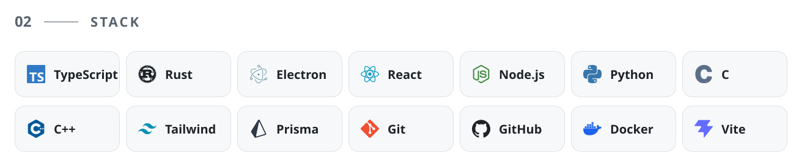

<a href="https://github.com/PoxiiTV"><picture><source media="(prefers-color-scheme: dark)" srcset=".github/assets/readme/hero-dark.svg"></picture></a>

<a href="https://poxilauncher.com"><picture><source media="(prefers-color-scheme: dark)" srcset=".github/assets/readme/now-dark.svg"></picture></a>

<a href="https://github.com/PoxiiTV?tab=repositories"><picture><source media="(prefers-color-scheme: dark)" srcset=".github/assets/readme/stack-dark.svg"></picture></a>

<a href="https://github.com/PoxiiTV?tab=repositories"><picture><source media="(prefers-color-scheme: dark)" srcset=".github/assets/readme/projects-dark.svg"></picture></a>

<a href="mailto:alexissjuarezz10@gmail.com"><picture><source media="(prefers-color-scheme: dark)" srcset=".github/assets/readme/contact-dark.svg"></picture></a>

hecho con 💚 por poxi

